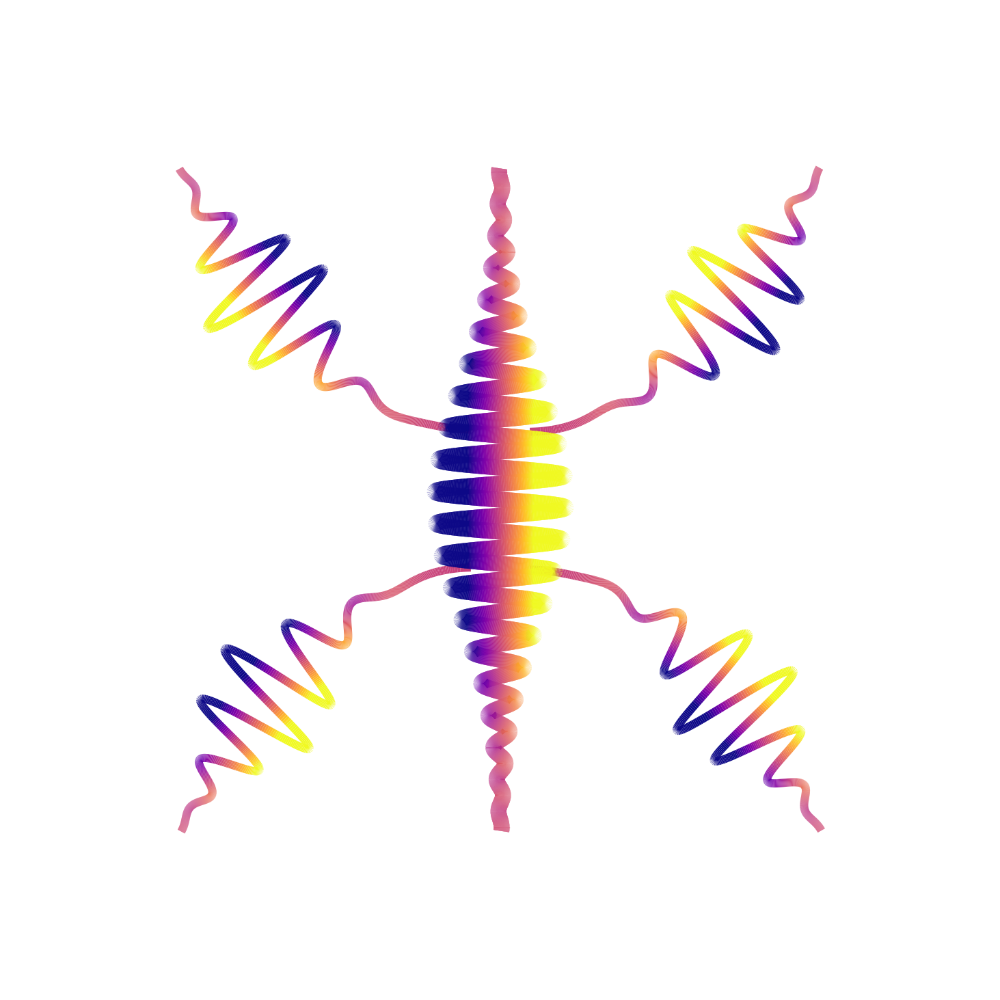

<p align="center">
  
</p>

<h1 align="center">TDSE-Z — Attosecond Quantum Dynamics, at Scale</h1>

<p align="center">
  <strong>C++17</strong> &middot; <strong>MPI</strong> &middot; <strong>PETSc</strong> &middot; <strong>SLEPc</strong> &middot; <strong>PetIGA</strong> &middot; <strong>CUDA</strong>
</p>

<p align="center">
  A high-performance C++ framework for solving the time-dependent Schrödinger equation
  in strong laser fields — atomic, molecular and solid-state systems resolved to the
  attosecond, scaled across MPI clusters and GPUs.
</p>

<p align="center">
  <a href="https://dahbiz.github.io/tdsez/">Website</a> &middot;
  <a href="https://dahbiz.github.io/tdsez/gallery.html">Gallery</a> &middot;
  <a href="https://dahbiz.github.io/tdsez/docs/">Documentation</a>
</p>

---

## Quick Start

```bash
# 1. Build (PETSc/SLEPc/PetIGA must be installed and discoverable)
mkdir build && cd build
cmake ..
make -j$(nproc)

# 2. Run
mpirun -np 4 ./tdsez -inp tests/inputs/ho1d.inp
```

## What It Does

TDSE-Z solves the time-dependent Schrödinger equation for single-particle quantum systems:

- **Static spectrum** — bound-state eigenvalues and eigenstates
- **Time propagation** — evolve an initial state under arbitrary laser fields
- **Dipole matrix** — transition elements $d_{ij} = \langle\psi_i|x|\psi_j\rangle$
- **Population tracking** — time-dependent bound-state occupations
- **Current / autocorrelation** — time-dependent observables
- **t-SURFF** — photoelectron energy spectra via the surface-flux method
- **Absorbing boundary (CAP)** — open-system dynamics

## Code Layout

| Component | Responsibility |
|-----------|----------------|
| `include/tdsez_parser.hpp`, `src/parser.cpp`, `src/parser_validation.cpp` | Input fields, file parsing, expression setup, and validation |
| `include/tdsez_info.hpp` | Shared terminal output formatting |
| `include/tdsez_core.hpp`, `src/core.cpp`, `src/core_knots.cpp` | Grid construction and bound-state solve |
| `include/tdsez_assembler.hpp`, `src/assembly/`, `src/assembler_class.cpp` | Operator assembly |
| `include/tdsez_manager.hpp`, `include/tdsez_propagator.hpp`, `src/manager.cpp`, `src/propagator.cpp`, `src/monitor.cpp` | Time evolution and output |
| `src/diagnostics.cpp` | Physics diagnostics |

`include/tdsez_internal.hpp` collects shared solver types and function
declarations. Individual class headers can be included separately.

## Key Features

- B-spline basis functions via PetIGA for high-accuracy spatial discretisation
- SLEPc eigensolvers (EPS/PEP) for eigenvalue problems
- PETSc time-stepping (TS) for propagation
- MPI parallelism across multiple nodes
- CUDA GPU offload for matrix operations (auto-detected)
- HDF5 output with full provenance metadata
- muParser for user-defined potentials, laser fields, and mass profiles

## Tests

```bash
# From the build directory
cd build && make test          # builds + runs pytest with 5 MPI procs

# Or directly
pytest tests/ -v -s
```

The suite validates eigenvalue convergence, propagation, and observables against
analytical references (1D/2D/3D harmonic oscillators). See [tests/README.md](tests/README.md).

## Dependencies

| Package | Purpose |
|---------|---------|
| PETSc 3.x | Portable, Extensible Toolkit for Scientific Computation |
| SLEPc | Scalable Library for Eigenvalue Problem Computations |
| PetIGA | Isogeometric Analysis with PETSc |
| muParser | Fast C++ expression parser |
| CMake 3.15+ | Build system |
| MPI (OpenMPI/MPICH) | Distributed parallelism |
| CUDA (optional) | GPU acceleration |
| HDF5 | Simulation output |
| Python 3 + pytest + numpy + h5py | Tests (optional) |

## Citing

If you use TDSE-Z in your research, please cite:

> TDSE-Z — Time-Dependent Schrödinger Equation Solver (B-spline / IGA)
> Dr. Zakaria Dahbi, Attosecond Quantum Physics Lab, King's College London, UK

## License

MIT License — Copyright (c) 2024–2026 Dr. Zakaria Dahbi.
See [LICENSE](LICENSE) for details.

## Contact

- **Research:** [www.attokings.com](https://www.attokings.com)
- **Email:** zakaria.dahbi@kcl.ac.uk
- **GitHub:** [dahbiz/tdsez](https://github.com/dahbiz/tdsez)
